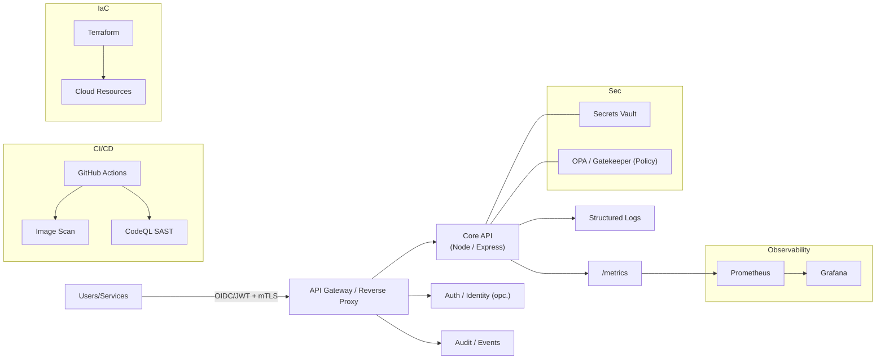

# 🛡️ Enterprise Zero Trust Architecture Suite

> Arquitectura moderna y segura basada en principios **Zero Trust**, con foco en **automatización**, **observabilidad**, **DevSecOps** y **buenas prácticas cloud‑native**. Este repositorio sirve como **plantilla profesional** lista para evolucionar a producción.

<p align="left">
  
  
  
  
</p>

---

## 📌 Objetivos del proyecto

* **Zero Trust by default:** mínimo privilegio, verificación continua, identidad primero, segmentación y cifrado extremo a extremo.
* **Operable desde el día 1:** scripts y plantillas para **local**, **Docker**, **CI/CD** y **Terraform**.
* **Observabilidad y AIOps:** métricas, logs y health‑checks listos; carpeta **aiops/** con ejemplos en Python.
* **DevSecOps integrado:** headers de seguridad, rate‑limit, escaneo de dependencias, SAST/contenerización segura.

---

## 🧱 Arquitectura (visión general)



> **Nota:** varios componentes son opcionales/plug‑and‑play (p. ej., OPA, Vault, Service Mesh, EKS). Esta suite prioriza el **acoplamiento débil** para evolucionar sin reescrituras masivas.

---

## 🧰 Tecnologías

* **Backend:** Node.js + Express (API modular, segura)
* **Seguridad Web:** Helmet (CSP/referrer/dnsPrefetch), `express-rate-limit`
* **Infra as Code:** Terraform (**infra/**)
* **Contenedores:** Docker (Dockerfile, docker‑compose)
* **Observabilidad:** endpoints `/health`, `/ready`, `/metrics` (Prometheus‑ready)
* **Automatización y AIOps:** Python (**aiops/**)
* **CI/CD:** GitHub Actions (lint, test, build, scan, release)
* **Docs/Blog técnico:** Jekyll (**/docs**) para artículos y runbooks

---

## 📂 Estructura del repositorio

```
.
├─ backend/
│  ├─ src/
│  │  ├─ app.js
│  │  ├─ routes/ (v1)
│  │  ├─ middlewares/
│  │  └─ security/
│  ├─ tests/ (unit/functional)
│  ├─ Dockerfile
│  └─ package.json
├─ aiops/
│  └─ scripts_python/ (anomaly_detection.py, log_watcher.py, etc.)
├─ infra/
│  └─ terraform/ (módulos: vpc, rds, s3, eks opc.)
├─ .github/workflows/ (CI/CD)
├─ docs/ (Jekyll)
├─ docker-compose.yml
├─ .env.example
└─ README.md
```

> *Los nombres de archivos son de referencia. Mantén esta estructura como guía para crecer ordenado.*

---

## ⚙️ Instalación y ejecución

### 1) Local (sin Docker)

```bash
cd backend
npm ci
npm start
```

API por defecto: **[http://localhost:3000](http://localhost:3000)**
Health check: **GET /health**
Readiness: **GET /ready**
Métricas: **GET /metrics** (Prometheus)

### 2) Docker

```bash
# raíz del repo
docker compose up --build -d
# o, si usas docker-compose clásico
# docker-compose up --build -d
```

### 3) Variables de entorno

Crea tu `.env` a partir de `.env.example`:

| Variable               | Descripción                             | Ejemplo              |
| ---------------------- | --------------------------------------- | -------------------- |
| `PORT`                 | Puerto HTTP                             | `3000`               |
| `NODE_ENV`             | entorno                                 | `production`         |
| `RATE_LIMIT_WINDOW_MS` | ventana de rate‑limit                   | `60000`              |
| `RATE_LIMIT_MAX`       | reqs por ventana                        | `100`                |
| `CSP_DIRECTIVES`       | política CSP (JSON o preset)            | `default-src 'self'` |
| `JWT_SECRET`           | secreto para tokens (si habilitas auth) | `changeme`           |
| `LOG_LEVEL`            | nivel de logs                           | `info`               |
| `READY_FLAG`           | marca de readiness                      | `true`               |

> **Seguridad:** nunca comitees `.env`. Usa secretos en GitHub Actions y/o un **Secrets Manager**.

---

## 🔐 Zero Trust aplicado (controles por defecto)

* **Identidad primero:** soporte para OIDC/JWT en la capa de API (módulo opcional `auth/`).
* **Mínimo privilegio:** middleware de autorización por recurso/acción (RBAC/ABAC).
* **Verificación continua:** health‑checks, probes, rate‑limit, bloqueo por IP/ASN (opcional).
* **Segmentación:** rutas por versión `/api/v1/*`, posibilidad de separar dominios por servicio.
* **Cifrado:** TLS extremo a extremo (recomendado con proxy inverso); mTLS opcional en servicio a servicio.
* **Políticas:** integración futura con **OPA/Gatekeeper** para políticas declarativas.
* **Telemetría:** `/metrics` (Prometheus) + logs estructurados + trazas (OpenTelemetry opc.).

### Helmet + CSP (ejemplo rápido)

```js
import helmet from 'helmet';
app.use(helmet());
app.use(helmet.contentSecurityPolicy({
  useDefaults: true,
  directives: {
    defaultSrc: ["'self'"],
    scriptSrc: ["'self'"],
    objectSrc: ["'none'"],
    upgradeInsecureRequests: []
  }
}));
```

### Rate limiting (ejemplo)

```js
import rateLimit from 'express-rate-limit';
const limiter = rateLimit({
  windowMs: Number(process.env.RATE_LIMIT_WINDOW_MS || 60000),
  max: Number(process.env.RATE_LIMIT_MAX || 100)
});
app.use(limiter);
```

---

## 🧪 Tests

```bash
cd backend
npm test          # unit + functional (si corresponde)
npm run test:unit # solo unitarios
npm run test:api  # e2e/funcionales (si está configurado)
```

Sugerencias CI: **lint**, **unit**, **functional/e2e**, **coverage**, **SAST (CodeQL)**, **dep scan (npm audit/OSV)**.

---

## 📈 Observabilidad

* **/metrics** listo para Prometheus.
* Dashboards de Grafana (exportables) en `docs/observability/` (opcional).
* Logs estructurados en JSON (nivel configurable).

---

## 🚢 CI/CD (GitHub Actions)

Pipeline sugerido en `.github/workflows/`:

1. **Lint & Test** → PR required checks
2. **Build** → Docker image (multi‑arch opc.)
3. **Security** → CodeQL + Trivy + secret scan
4. **Release** → versión semántica + publicación de imagen
5. **Deploy** → a entorno staging/prod (si configuras cloud)

> Usa **GitHub Environments** con **secrets** y **protection rules**.

---

## 🏗️ Infraestructura (Terraform)

Estructura en `infra/terraform/` con módulos reutilizables. Ejemplo de ciclo:

```bash
cd infra/terraform
terraform init
terraform plan -out tf.plan
terraform apply tf.plan
```

> Recomendado: backends remotos, state locking, y políticas de seguridad (CIS/NIST). Añade cifrado en reposo y en tránsito (KMS, TLS).

---

## 🤖 AIOps (Python)

Ejemplos en `aiops/`:

* Detección simple de anomalías por ventana móvil
* Watchers de logs con umbrales
* Hooks para abrir issues automáticos en GitHub (incidentes)

---

## 🗺️ Roadmap

* [ ] Autenticación OIDC + RBAC/ABAC por recurso
* [ ] OpenTelemetry (tracing) + dashboards de servicio
* [ ] mTLS servicio a servicio (SPIFFE/SPIRE opc.)
* [ ] Integración OPA/Gatekeeper (policy‑as‑code)
* [ ] Terraform módulos EKS + RDS + WAF + ALB con TLS
* [ ] Pruebas de carga (k6/Artillery) y caos (Litmus)
* [ ] Pipeline de despliegue canario/blue‑green

---

## 🤝 Contribución

1. Crea un branch desde `main`
2. Asegura **lint + tests** en local
3. Abre PR con descripción y checklist de seguridad
4. Mantén commits atómicos y convencionales

---

## 🔒 Seguridad

* No subas secretos. Usa **.env.example** y gestores de secretos.
* Habilita 2FA en GitHub.
* Ejecuta los escáneres de seguridad en cada PR.
* Reporta vulnerabilidades por Issues con etiqueta `security` (sin exponer datos sensibles).

---

## 👤 Autor

**© 2025 Emanuel** — Licencia **MIT**

* 🌐 LinkedIn: [https://www.linkedin.com/in/emanuel-gonzalez-michea/](https://www.linkedin.com/in/emanuel-gonzalez-michea/)
* 🧰 GitHub: [https://github.com/Emanuelgm1998/enterprise-zero-trust-architecture](https://github.com/Emanuelgm1998/enterprise-zero-trust-architecture)


